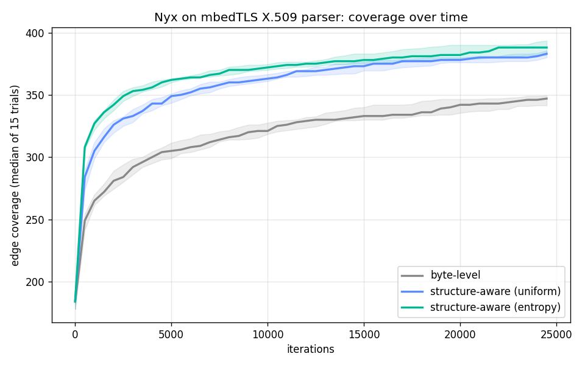

# Nyx

**A structure-aware, entropy-guided fuzzer for ASN.1/DER parsers — built to find
real memory-safety bugs in X.509 certificate parsing.**

Generic fuzzers waste most of their effort on inputs a structured parser rejects
in the first few bytes. Nyx mutates a *parsed DER tree* instead of raw bytes, so
every candidate stays structurally valid and reaches deep parser code — then it
spends its energy where an information-theoretic signal says the payoff is
highest.

> **Status:**
> - ✅ **DER core** — tree IR + parser + serializer, round-trips a real X.509 cert byte-for-byte.
> - ✅ **Phase 0** — SanitizerCoverage plumbing: edge coverage + `trace-cmp` operand capture, tested.
> - ✅ **Phase 1** — working coverage-guided loop: corpus, byte mutator, in-process
>   execution with crash trapping. Demonstrated finding a planted bug that blind
>   fuzzing misses in the same budget.
> - ✅ **Phase 2** — structure-aware mutator on the DER tree (10 tree operators +
>   length-confusion). On a structure-gated target it found the bug in ~8k
>   iterations while byte-level fuzzing missed it in 300k, and reached strictly
>   more coverage — the core differentiator, measured.
> - ✅ **Phase 2b** — X.509 semantic grammar: a valid-certificate skeleton builder
>   plus typed mutations (boundary dates, hostile serials, malformed OIDs,
>   duplicated extensions). On a target gated behind a semantically-valid boundary
>   date, semantic mutation found the bug in ~130 iterations while generic
>   structure-aware missed it in 400k.
> - ✅ **Phase 3** — entropy-guided scheduler: rarity-weighted seed energy
>   (self-information `-log2 p`) + a UCB1 operator bandit, with a uniform control.
>   Mechanics proven deterministically (rare seed chosen 94% vs 20%; bandit
>   converges to the rewarding operator).
> - ✅ **Phase 4** — benchmark on the **real mbedTLS X.509 parser** (11,783
>   instrumented edges), 15 trials × 25k iters with Mann-Whitney U significance:
>   structure-aware reaches **+10%** coverage over byte-level (p≈1.7e-6) and the
>   entropy scheduler adds a further significant gain over uniform (p≈0.017).
>   See [`bench/results/RESULTS.md`](bench/results/RESULTS.md).

## Headline result



On the real **mbedTLS** certificate parser, structure-aware fuzzing significantly
out-covers byte-level mutation, and the entropy-guided scheduler adds a further
significant gain over a uniform control — measured over 15 trials with
non-parametric significance testing, not a single run. Full numbers, methodology
and an honest counter-result (where structure awareness does *not* help) are in
[`bench/results/RESULTS.md`](bench/results/RESULTS.md).

## Why it's built this way

- **Structure-aware:** a DER value is a nested Tag-Length-Value tree. Nyx parses
  a seed into that tree, mutates the tree, and re-serialises — so it gets past
  the tag/length checks that kill random byte mutations.
- **Entropy-guided:** seeds that reach *rare* coverage edges carry more
  information (`-log2(p)`), so they get more mutation energy; mutation operators
  are chosen by a bandit governed by reward entropy. Whether this beats fixed
  schedules is settled by benchmark, not asserted.
- **Honest evaluation:** FuzzBench-style, ≥10 trials, median coverage with CI,
  and a Mann-Whitney U test against **Nautilus** (the closest prior work),
  AFL++ and libFuzzer.

See [DESIGN.md](DESIGN.md) for the full architecture, prior-art positioning, and
evaluation plan.

## Build & test

```bash
cmake -S . -B build -DCMAKE_BUILD_TYPE=RelWithDebInfo
cmake --build build -j
ctest --test-dir build --output-on-failure
```

The test suite parses a hand-built structure, exercises high-tag-number and
long-form length encodings, and (given a path) round-trips a real certificate:

```bash
# generate a DER cert and round-trip it through the core
openssl req -x509 -newkey rsa:2048 -nodes -days 365 \
  -keyout /tmp/k.pem -out /tmp/c.pem -subj "/CN=test"
openssl x509 -in /tmp/c.pem -outform DER -out /tmp/c.der
./build/test_roundtrip /tmp/c.der
```

Build with sanitizers while hacking on the engine itself:

```bash
cmake -S . -B build-asan -DNYX_ASAN=ON -DCMAKE_CXX_COMPILER=clang++
cmake --build build-asan -j && ctest --test-dir build-asan
```

## Targets

libtasn1 (primary), mbedTLS, OpenSSL — fetched and instrumented via
`third_party/fetch_targets.sh`, hit through the harnesses in `harnesses/`.

## Layout

```
include/nyx/   core headers (tree, parser, serializer, mutator, scheduler, coverage, grammar)
src/           implementations + fuzzer driver (main.cpp)
tests/         DER core tests (round-trip, encodings)
harnesses/     libFuzzer-style harnesses for each target
bench/         FuzzBench-style benchmark harness + plots
third_party/   pinned target fetch/build scripts (not vendored)
grammars/      X.509 grammar notes
```

## License

MIT — see [LICENSE](LICENSE).
